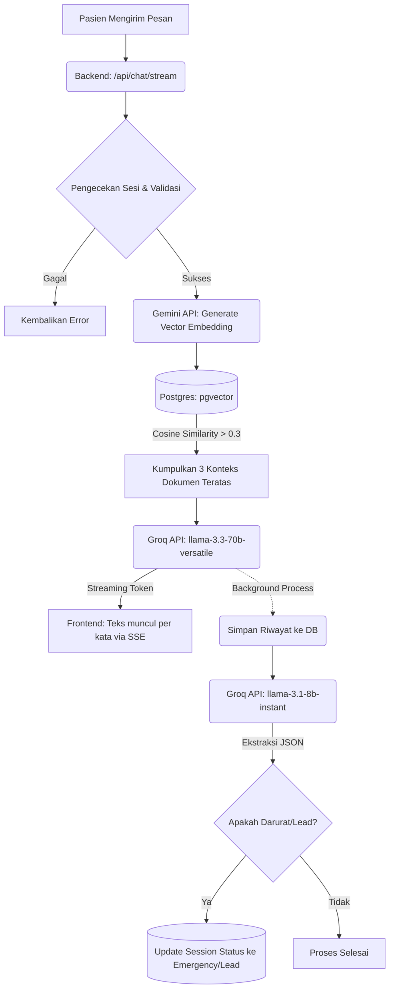

# Penjelasan Khusus Chatbot AI (GlucoCare)

Sistem chatbot pada GlucoCare dirancang khusus sebagai asisten cerdas berbasis **Retrieval-Augmented Generation (RAG)**. Sistem ini menggabungkan pencarian dokumen semantik dengan kemampuan *Large Language Model* (LLM) untuk memberikan jawaban medis yang akurat, relevan, dan terpercaya.

## 1. Arsitektur & Teknologi Chatbot

Chatbot ini dirancang dengan pendekatan modular di backend, mengandalkan beberapa layanan inti:

*   **Groq API (Inferensi LLM)**: 
    *   Menggunakan model `llama-3.3-70b-versatile` sebagai otak utama untuk menjawab *chat* pasien.
    *   Menggunakan model yang lebih ringan `llama-3.1-8b-instant` secara khusus untuk mengekstraksi data di belakang layar (misalnya menentukan apakah pasien dalam kondisi darurat atau menjadi calon pasien/lead).
*   **Gemini API (Embedding)**: 
    *   Menggunakan model `gemini-embedding-001` untuk mengubah teks (pertanyaan user maupun dokumen *knowledge base*) menjadi vektor numerik (3072 dimensi).
*   **PostgreSQL + pgvector**: 
    *   Database relasional yang diperkuat dengan ekstensi `pgvector` untuk menyimpan vektor dari Gemini dan melakukan pencarian semantik (mencari dokumen medis terdekat menggunakan *Cosine Similarity*).
*   **Server-Sent Events (SSE)**: 
    *   Memungkinkan respons dari Groq (LLM) dialirkan (di-stream) ke *frontend* token demi token, sehingga pengguna merasa chatbot merespons secara langsung dan responsif.

---

## 2. Alur Kerja (Flow) RAG Chatbot

Proses yang terjadi setiap kali pengguna mengirim pesan ke Chatbot:

1.  **Menerima Pesan**: Backend menerima pertanyaan medis dari *frontend* melalui endpoint `/api/chat/stream`.
2.  **Pembuatan Embedding**: Pertanyaan pengguna dikirim ke **Gemini API** untuk diubah menjadi *vector embedding*.
3.  **Pencarian Semantik (Retrieval)**: Backend melakukan pencarian ke database PostgreSQL menggunakan ekstensi `pgvector`. Query ini mencari dokumen di tabel `KnowledgeBase` yang *similarity score*-nya (berdasarkan Cosine Similarity) di atas ambang batas 0.3. Sistem akan mengambil maksimal 3 dokumen yang paling relevan.
4.  **Prompt Engineering**: Backend menyusun sebuah "Prompt Sistem" (Instruksi) yang berisi:
    *   Instruksi persona (berperan sebagai Asisten Medis GlucoCare).
    *   Riwayat percakapan sebelumnya (agar bot mengenali konteks obrolan).
    *   Konteks dokumen medis hasil temuan di langkah ke-3.
    *   Pertanyaan pasien yang terbaru.
5.  **Generasi Jawaban (Generation)**: Keseluruhan prompt tersebut dikirim ke **Groq API**. Groq akan membaca panduan dokumen dan merangkai jawaban. Jawabannya dialirkan (*di-stream* menggunakan SSE) langsung ke pasien.
6.  **Klasifikasi Latar Belakang (Asynchronous)**: Secara asinkron (di background task), pesan pengguna dan jawaban AI juga dianalisis ulang oleh model LLM ekstraksi untuk menentukan apakah percakapan ini mengandung indikasi **Emergency** (darurat medis) atau menghasilkan **Lead** (pengguna ingin berkonsultasi lebih lanjut dengan dokter asli). Jika ya, status *Chat Session* di database akan otomatis ter-update dan tampil di Dashboard Admin.

---

## 3. Flowchart Chatbot AI

Berikut adalah diagram alir dari cara kerja Chatbot secara visual:

