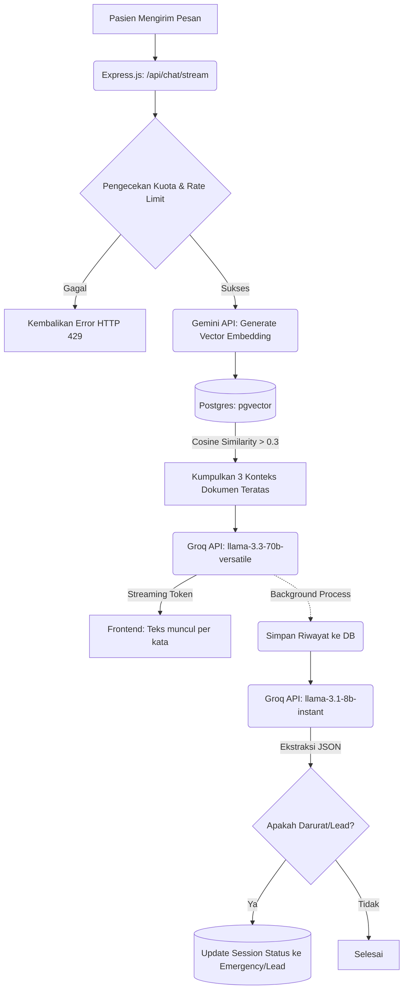

# Analisis Khusus Chatbot AI (GlucoCare)

Sistem chatbot pada GlucoCare bukan sekadar bot penjawab kata kunci biasa, melainkan asisten cerdas berbasis **Retrieval-Augmented Generation (RAG)**. Sistem ini menggabungkan pencarian dokumen semantik dengan kemampuan *Large Language Model* (LLM) untuk memberikan jawaban medis yang akurat, relevan, dan terpercaya.

## 1. Arsitektur & Teknologi Chatbot

Chatbot ini dirancang dengan pendekatan modular di backend, mengandalkan beberapa layanan inti:

*   **Groq API (Inferensi LLM)**: 
    *   Menggunakan model `llama-3.3-70b-versatile` sebagai otak utama untuk menjawab chat pasien.
    *   Menggunakan model yang lebih kecil `llama-3.1-8b-instant` secara khusus untuk mengekstraksi data (misalnya menentukan apakah pasien dalam kondisi darurat atau menjadi calon pasien/lead).
*   **Gemini API (Embedding)**: 
    *   Menggunakan model `gemini-embedding-001` untuk mengubah teks (pertanyaan user maupun dokumen *knowledge base*) menjadi vektor numerik (3072 dimensi).
*   **PostgreSQL + pgvector**: 
    *   Database relasional yang diperkuat dengan ekstensi `pgvector` untuk menyimpan vektor dari Gemini dan melakukan pencarian semantik (mencari dokumen medis terdekat menggunakan *Cosine Similarity*).
*   **Server-Sent Events (SSE)**: 
    *   Memungkinkan respons dari Groq (LLM) dialirkan (di-stream) ke *frontend* token demi token, sehingga pengguna merasa chatbot merespons dengan cepat layaknya ChatGPT.

## 2. Alur Kerja (Flow) Chatbot (RAG Process)

Proses yang terjadi setiap kali pengguna mengirim pesan ke Chatbot:

1.  **Menerima Pesan**: Backend menerima pertanyaan medis dari *frontend* melalui endpoint `/api/chat/stream`.
2.  **Pembuatan Embedding**: Pertanyaan pengguna dikirim ke **Gemini API** untuk diubah menjadi *vector embedding*.
3.  **Pencarian Semantik (Retrieval)**: Backend melakukan query ke PostgreSQL menggunakan ekstensi `pgvector`. Query ini mencari dokumen di tabel `knowledge_base` yang *similarity score*-nya (berdasarkan Cosine Similarity) lebih besar dari 0.3. Sistem akan mengambil maksimal 3 dokumen paling relevan.
4.  **Prompt Engineering**: Backend menyusun sebuah "Prompt Sistem" yang berisi:
    *   Instruksi persona (sebagai Asisten Medis GlucoCare).
    *   Riwayat percakapan sebelumnya (agar bot memiliki ingatan konteks).
    *   Konteks dokumen medis hasil temuan di langkah ke-3.
    *   Pertanyaan pengguna yang terbaru.
5.  **Generasi Jawaban (Generation)**: Prompt tersebut dikirim ke **Groq API**. Groq akan membaca panduan dokumen dan merangkai jawaban. Jawabannya di-stream (SSE) ke klien.
6.  **Klasifikasi State (Background Task)**: Secara asinkron, pesan pengguna dan jawaban AI juga dianalisis oleh AI model ekstraksi untuk menentukan apakah percakapan ini mengandung indikasi **Emergency** (darurat medis) atau menghasilkan **Lead** (pengguna ingin berkonsultasi dengan dokter asli). Jika ya, status *Chat Session* di database akan di-update sehingga admin dapat memantaunya di *Dashboard*.

## 3. Apa yang Telah Dibuat (Current State)

Saat ini fitur chatbot sudah matang dalam menangani tanya jawab dasar:
- [x] **RAG Pipeline**: Integrasi Gemini Embedding dan Groq LLM sudah berjalan baik dengan pipeline `pgvector`.
- [x] **Manajemen Sesi Chat**: Sesi chat disimpan menggunakan Cookie (`CHAT_SESSION_TTL_DAYS=30`) sehingga percakapan tidak hilang saat halaman di-refresh.
- [x] **Streaming SSE**: Respons sudah berbentuk *streaming* yang mulus di UI.
- [x] **Klasifikasi Otomatis**: Chat session dapat secara otomatis dikategorikan sebagai *Emergency* atau *Lead* oleh AI tanpa campur tangan manusia.
- [x] **Dukungan Referensi (Sources)**: Saat AI menjawab, AI mengembalikan referensi dokumen sumber dari `knowledge_base` yang digunakan.

## 4. Apa yang Perlu Dibuat Selanjutnya (Roadmap Chatbot)

Beberapa peningkatan yang spesifik untuk meningkatkan sistem Chatbot:

*   **Penyambungan (Handoff) ke Manusia (Dokter/CS)**: Jika AI mendeteksi status *Emergency* atau *Lead*, sistem harus memiliki kemampuan UI/UX untuk menyambungkan pasien ke *Live Chat* dengan dokter atau admin nyata, menghentikan respons AI, dan membiarkan manusia mengambil alih (*human-in-the-loop*).
*   **Vector Database Optimization**: Saat ini menggunakan `pgvector` bawaan yang sudah bagus untuk skala kecil-menengah. Ke depan perlu diterapkan strategi *chunking* dokumen (pemotongan teks) yang lebih rapi (misal: memecah PDF artikel medis menjadi paragraf terpisah) sebelum di-embed.
*   **Personalisasi Pasien**: Jika nanti sistem *User Auth* dibuat, Chatbot harus disuplai dengan Riwayat Medis pasien (umur, jenis kelamin, obat yang sedang dikonsumsi) di dalam prompt sistem agar jawaban bisa lebih disesuaikan secara pribadi.
*   **Pencegahan Halusinasi yang Lebih Ketat**: Menambahkan mekanisme deteksi jika LLM mencoba menjawab di luar konteks dokumen medis yang diberikan (Guardrails).

## 5. Flowchart Spesifik Chatbot (RAG & Ekstraksi)

