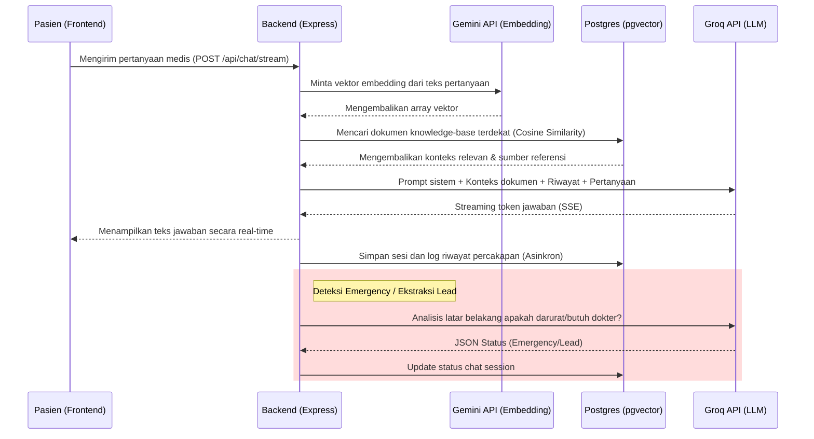

# Analisis Proyek GlucoCare Telehealth

Proyek GlucoCare adalah platform telehealth komprehensif yang dirancang untuk menyediakan layanan kesehatan, katalog produk, pencarian dokter, dan asisten medis cerdas (chatbot) berbasis AI (RAG). 

## 1. Tech Stack (Teknologi yang Digunakan)

- **Frontend**: Next.js 16 (React 19), Tailwind CSS 4, Framer Motion (untuk animasi UI), TypeScript.
- **Backend**: Express.js 5, Node.js runtime environment via **Bun** 1.3, TypeScript.
- **Database**: PostgreSQL 17 (dijalankan via Docker).
- **ORM**: Prisma 7 (dengan adapter `pg`).
- **AI & ML**: 
  - **Groq API**: Digunakan untuk inferensi LLM utama (model `llama-3.3-70b-versatile` untuk chat dan `llama-3.1-8b-instant` untuk ekstraksi lead).
  - **Gemini API**: Digunakan untuk Embedding dokumen *knowledge base* (model `gemini-embedding-001`).
  - **pgvector**: Ekstensi PostgreSQL untuk menyimpan dan mencari vektor embedding (Retrieval-Augmented Generation / RAG).

## 2. Apa yang Telah Dibuat (Status Saat Ini)

Berdasarkan analisis repositori frontend dan backend, berikut adalah fitur-fitur yang sudah berjalan:

*   **Sistem Katalog Publik**: API dan UI untuk melihat daftar produk kesehatan aktif dan direktori dokter yang tersedia.
*   **Chatbot AI dengan RAG**: Asisten AI pintar yang bisa menjawab pertanyaan medis berdasarkan *knowledge base* (sumber dokumen internal) alih-alih sekadar kata kunci. Chatbot juga dilengkapi dengan deteksi status darurat (emergency) dan ekstraksi lead pasien.
*   **Autentikasi Admin**: Sistem login berbasis *HTTP-only cookies* untuk keamanan admin menggunakan Argon2id untuk hashing password.
*   **Dashboard Admin**: Panel kontrol untuk mengelola (CRUD) data produk, data dokter, serta memantau statistik dan riwayat sesi chat/lead yang masuk.
*   **Infrastruktur Database Dockerized**: Setup database PostgreSQL yang sudah disematkan ekstensi `pgvector` untuk mendukung kemampuan pencarian semantik asisten AI.

## 3. Apa yang Perlu Dibuat Selanjutnya (Roadmap/Rekomendasi)

Untuk menjadikan platform ini sepenuhnya *production-ready* dan *full-featured*, beberapa pengembangan lanjutan yang direkomendasikan adalah:

*   **Autentikasi Pengguna (Pasien)**: Saat ini identitas pengguna di chatbot hanya berbasis *session cookie* (anonim). Perlu ada sistem pendaftaran/login untuk pasien agar riwayat medis dan transaksi bisa disimpan permanen.
*   **Integrasi Payment Gateway**: Untuk memproses pembelian produk kesehatan atau biaya konsultasi dokter berbayar secara nyata (misalnya Midtrans, Xendit, atau Stripe).
*   **Fitur Telekonsultasi Langsung (Live Chat/Video Call)**: Mengizinkan pasien berbicara langsung dengan dokter sungguhan (real-time) setelah tahap penapisan (screening) oleh asisten AI.
*   **Notifikasi & Pengingat**: Integrasi email (misalnya Resend/SendGrid) atau Push Notification (Web/Mobile) untuk mengingatkan jadwal konsultasi atau pengiriman obat.
*   **Sistem Manajemen Rekam Medis (EMR)**: Dasbor khusus bagi dokter (selain admin) untuk melihat rekam medis pasien hasil ekstraksi AI dan menambahkan diagnosis.

## 4. Arsitektur & Alur Kerja (Architecture Flow)

Arsitektur aplikasi menggunakan pola **Client-Server** tradisional namun modern:

1.  **Client Layer (Next.js Frontend)**: Berjalan di port 3000, menangani perenderan UI. Memanggil backend untuk mendapatkan data secara dinamis. Menggunakan Server-Sent Events (SSE) `/api/chat/stream` untuk menampilkan respons chatbot secara *real-time streaming*.
2.  **API Layer (Express.js Backend)**: Berjalan di port 4000 (di dev). Menerima permintaan dari Frontend. Menangani validasi bisnis (Zod), manajemen sesi cookie, dan *rate limiting*.
3.  **Data & AI Layer (Prisma + Postgres + LLM)**: Backend berkomunikasi secara asinkron dengan:
    *   **Postgres**: Menyimpan state (sesi, riwayat chat, produk, dokter, dll).
    *   **Gemini (Embedding)**: Saat pengguna bertanya, backend mengubah teks ke bentuk vektor untuk mencari referensi dokumen terdekat di `pgvector`.
    *   **Groq (LLM)**: Konteks dari dokumen yang relevan dikirimkan ke model Groq untuk merangkum jawaban akhir yang akurat bagi pasien.

## 5. Flowchart Chatbot AI (RAG)

Berikut adalah diagram alir bagaimana pesan pengguna diproses oleh sistem AI:

